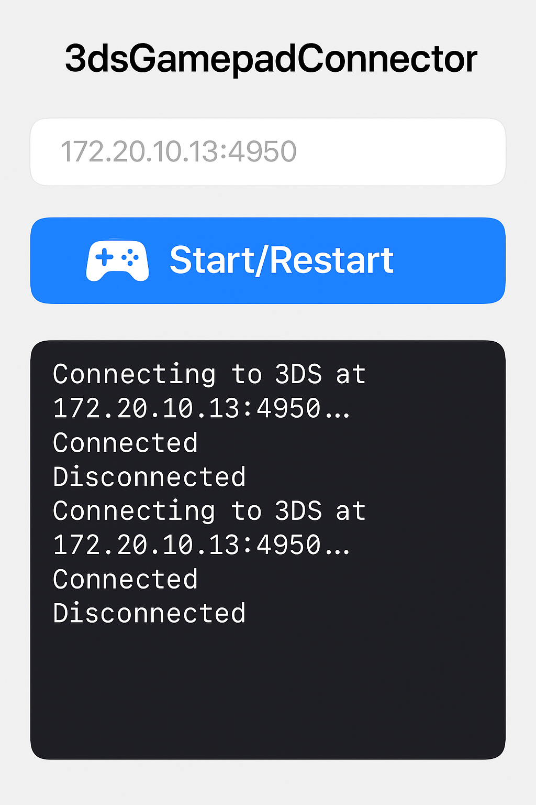

# 3dsGamepadConnector

iOS app for connecting external gamepads to Nintendo 3DS consoles using Luma3DS InputRedirection.

## Overview

Bridges iOS-compatible gamepads to 3DS consoles. Captures gamepad input on iOS and transmits it via UDP to a 3DS running Luma3DS with InputRedirection enabled.

## Features

- Automatic gamepad detection
- Real-time input mapping (20Hz)
- UDP network communication
- Supports all 3DS controls (D-pad, buttons, triggers, thumbsticks)

## Prerequisites

### 3DS Setup
- Luma3DS custom firmware installed
- InputRedirection enabled in Luma3DS settings
- 3DS and iOS device on same network

### iOS Requirements
- iOS 13.0+
- Compatible gamepad (MFi, DualShock 4, Xbox One, etc.)
- Network connectivity

## Installation

1. Clone the repository
2. Open `3dsGamepadConnector.xcodeproj` in Xcode
3. Build and run on your iOS device

## Usage

**Requirements**: Both devices must be connected to the same WiFi network.

1. Connect gamepad to iOS device
2. Enter 3DS IP address (format: `172.20.10.13:4950`)
3. Tap "Start/Restart" button
4. Monitor connection status in log window



*The app interface showing IP address input, Start/Restart button, and connection log window.*

## Development

### Project Structure
```
3dsGamepadConnector/
├── _dsGamepadConnectorProjectApp.swift  # App entry point
├── GamepadView.swift                    # Main UI and gamepad handling
├── Service/
│   ├── GamepadButtonsMapper.swift       # Input mapping
│   ├── SendGamepadButtonsTask.swift     # Background transmission
│   ├── StdOutListener.swift             # Log handling
│   └── UdpClient.swift                  # Network communication
```

## License

GNU General Public License v3.0 - see [LICENSE](LICENSE) file.

## Acknowledgments

- **Luma3DS Team**: For the [Luma3DS](https://github.com/LumaTeam/Luma3DS) custom firmware and InputRedirection feature
- **InputRedirectionClient-Qt**: Thank you for the [InputRedirectionClient-Qt](https://github.com/mastermune/InputRedirectionClient-Qt) project that inspired this iOS implementation

## Disclaimer

This software is provided as-is. Not affiliated with Nintendo, Apple, or any other company.

